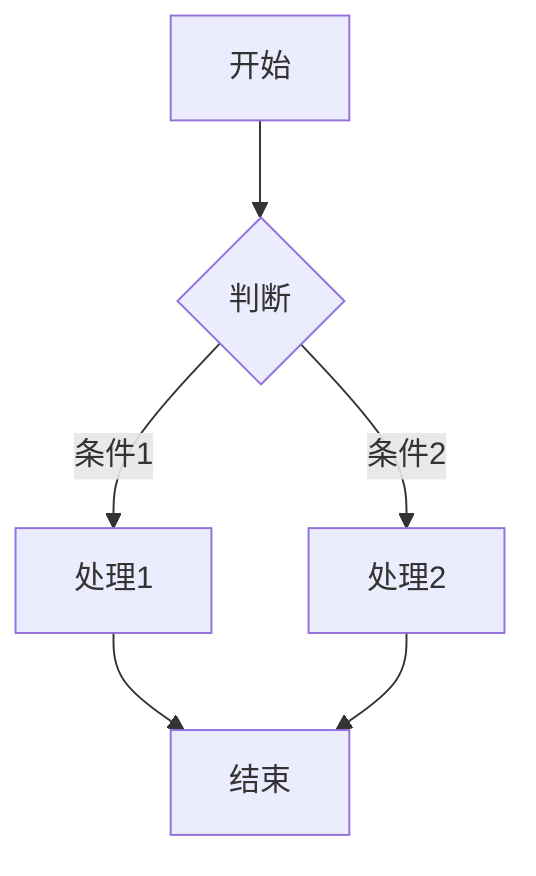

# 详细写作规则

# 详细写作规则

## 一、读者定位与内容深度

### 1.1 目标读者画像

**核心读者**：中高级软件工程师（5-10年经验）

**特征**：
- 有扎实的技术基础，不需要解释基础概念
- 有实际项目经验，能理解复杂场景
- 追求深度，厌烦浅尝辄止
- 希望获得可落地的实践方法

### 1.2 深入浅出的标准

**深入（给足深度）**：
- 原理必须有推导过程（不是"是这样"，而是"为什么是这样"）
- 技术细节必须完整（代码、配置、命令，可复制执行）
- 权衡必须有分析（不是"选A"，而是"什么情况下选A，什么情况下选B"）

**浅出（易于理解）**：
- 用类比解释复杂概念（但类比必须准确）
- 用图表可视化抽象逻辑
- 用案例串联知识点

**反例**：
```
错误（太浅）：
AI可以帮助程序员提高效率。

错误（太深，晦涩）：
基于Transformer架构的大语言模型通过自注意力机制...（3页数学推导）

正确（深入浅出）：
AI代码补全的原理是"预测下一个词"。就像你输入"你好"，手机会预测"世界"。

Copilot把整段代码当成"句子"，预测你接下来要写的"词"（代码 token）。

关键区别：
- 你手机用几百MB的模型，Copilot用数十GB
- 你手机学了几万条短信，Copilot学了数亿行代码
- 所以Copilot能预测"整行代码"，而不只是"下一个词"
```

### 1.3 仔细详尽的要求

**每个关键概念**：
- 定义是什么
- 为什么重要
- 怎么用（完整代码/命令）
- 常见坑点
- 最佳实践

**每个工具推荐**：
- 具体版本号（"Go 1.21"而不是"最新版"）
- 安装命令（可复制粘贴）
- 配置示例（完整文件，不是片段）
- 验证方式（如何确认安装成功）

**每个案例**：
- 背景（什么团队、什么阶段）
- 问题（具体症状，不是抽象描述）
- 方案（完整步骤，可复现）
- 结果（量化数据，时间/成本/质量）
- 反思（关键决策点，为什么选这个方案）

## 二、图表规范

### 2.1 图表类型选择

| 图表类型 | 推荐格式 | 适用场景 | 示例 |
|:---|:---|:---|:---|
| 流程图 | Mermaid | 工作流、决策流程、数据处理 | 开发流程、审核流程 |
| 时序图 | Mermaid | 交互过程、调用链 | 系统间通信、API调用 |
| 架构图 | SVG | 系统组件关系、部署拓扑 | 微服务架构、系统架构 |
| 示意图 | SVG/Mermaid | 概念解释、原理说明 | AI工作原理、数据流向 |
| 对比图 | Mermaid | 前后对比、方案对比 | 传统vsAI方式 |
| 思维导图 | Mermaid | 知识结构、决策树 | 技能树、选择决策 |

### 2.2 Mermaid 规范

**代码块格式**：
```markdown

```

**样式要求**：
- 使用标准语法，确保GitHub/GitLab可渲染
- 节点命名清晰（A、B、C→有语义的名字）
- 复杂图表分层次（主流程+子流程）
- 配色使用Mermaid默认（确保一致性）

**每个图表后必须有文字说明**：
```markdown


**图1-1：AI辅助开发流程**
- **①需求输入**：开发者用自然语言描述需求
- **②AI生成**：AI基于上下文生成代码草稿
- **③人工审查**：开发者审查、修改、确认
- **④测试验证**：自动化测试+人工测试
- **⑤集成部署**：代码合并到主干，自动部署

关键设计：人工审查在AI生成和测试验证之间，形成质量门禁。
```

### 2.3 SVG 规范

**使用场景**：
- 复杂架构图（组件多、层次多）
- 需要精确控制布局的图表
- 需要特殊视觉效果的示意图

**文件位置**：`assets/diagrams/章节号-图表名.svg`

**命名规范**：
- `ch01-value-pyramid.svg`（第1章价值金字塔）
- `ch03-collab-modes.svg`（第3章协作模式对比）

**每个SVG后必须有文字说明**：
```markdown


**图5-2：RICE框架结构**
- **Role（角色）**：定义AI扮演的角色，如"资深后端工程师"
- **Input（输入）**：提供完整上下文，包括代码、环境、业务背景
- **Constraint（约束）**：明确限制条件，如"不使用第三方库"
- **Expectation（期望）**：定义期望输出，如"返回JSON格式"

四要素缺一不可，缺少任何一个都会导致输出质量下降。
```

### 2.4 图表红线

- **禁止**：纯ASCII图表（可读性差）
- **禁止**：低分辨率截图（打印模糊）
- **禁止**：无文字说明的图表（读者看不懂重点）
- **禁止**：过度装饰的图表（分散注意力）

## 三、章节衔接规则

### 3.1 绝不跳跃原则

**新概念必须有铺垫**：
- 第5章提到的"RICE框架"，必须在第3-4章有概念铺垫
- 第10章的"边界条件检查"，必须在第7章有代码示例

**处理方式**：
```markdown
第7章（提示工程进阶）首次提到：
"Chain of Thought是一种让AI展示思考过程的技术..."

第10章（AI代码质量）引用时：
"回顾第7章介绍的Chain of Thought技术（详见第7章第3节），
我们可以用它来分析AI代码的推理过程..."
```

### 3.2 承上启下结构

**每章开头必须包含**：
1. 回顾上一章核心结论（1段）
2. 指出上一章未解决的问题/遗留的疑问（1段）
3. 说明本章如何解决这些问题（1段）

**示例**：
```markdown
## 第6章：提示工程基础

> 一句话核心观点

上一章（第5章）我们讨论了人机协作的认知分工——AI擅长模式识别，
人类擅长价值判断。但知道分工还不够，关键在于：如何让AI发挥它的优势？

这就涉及到"提示工程"——与AI有效沟通的技术。

第5章留下了一个问题：同样是Copilot，为什么有人能写出高质量代码，
有人却只能得到一堆垃圾？差别就在于提示质量。

本章将回答：如何写出高质量的提示？
```

### 3.3 渐进式难度曲线

**难度控制**：
| 章节范围 | 难度等级 | 特点 |
|:---|:---:|:---|
| 第1-3章 | 入门级 | 建立认知框架，少代码，多概念 |
| 第4-9章 | 进阶级 | 核心技能，有代码示例，可动手实践 |
| 第10-14章 | 高级 | 质量控制、架构设计，需要项目经验支撑 |
| 第15-24章 | 实战级 | 完整场景，综合应用前面所有知识 |
| 第25-26章 | 前沿级 | 探索性内容，开放性结论 |

**渐进方式**：
- 第1章只讲"是什么"，第2章讲"为什么"，第3章开始讲"怎么做"
- 每个新概念，先用1个简单例子引入，再用1个复杂例子深化
- 实践工具的复杂度，从单文件脚本逐步提升到多模块项目

### 3.4 前后呼应有迹可循

**引用前面章节**：
- 必须给出具体章节号
- 简要回顾核心内容（让读者不需要翻回去）

**示例**：
```markdown
错误：
"前面提到的RICE框架..."

正确：
"回顾第6章介绍的RICE框架（Role-Input-Constraint-Expectation），
特别是Constraint（约束）要素——明确限制条件往往比描述需求更重要..."
```

**为后面章节铺垫**：
- 结尾可以提出未解决的问题
- 预告下一章内容

**示例**：
```markdown
第6章结尾：

"掌握了RICE框架，你已经能写出合格的提示。但想写出优秀的提示，
还需要更高级的技巧——Chain of Thought、Few-shot引导、多角色辩论...

这些将是第7章的内容。"
```

### 3.5 衔接检查清单

每章完成后检查：
- [ ] 开篇是否回顾了上一章？
- [ ] 是否说明了本章与上一章的关系？
- [ ] 本章新概念是否有前置铺垫？
- [ ] 引用前面章节时是否给出具体章节号？
- [ ] 是否为下一章留下了自然的引子？
- [ ] 难度是否比上一章略有提升（或保持）？

## 四、语言风格规则

### 1.1 禁用表达清单（绝对禁止）

| 禁用表达 | 错误示例 | 正确改写 |
|:---|:---|:---|
| "值得注意的是" | 值得注意的是，AI正在改变编程 | AI正在改变编程。GitHub Copilot的数据显示... |
| "让我们来看一下" | 让我们来看一下这个案例 | 某团队的做法很典型： |
| "这是一个很重要的问题" | 这是一个很重要的问题 | 直接说问题本身 |
| "在当今..." | 在当今的软件开发中 | 2024年，软件开发... |
| "随着...的发展" | 随着AI技术的发展 | 直接说结果 |
| 万能句式 | 不是A而是B | 直接说B |
| 过度感叹 | 太棒了！非常重要！ | 去掉感叹号 |
| 空洞赞美 | 这是一个很好的实践 | 说明为什么好 |

### 1.2 推荐表达模式

**直接陈述**：
```
不推荐：值得注意的是，AI代码审查有很多好处
推荐：AI代码审查能发现人类容易忽略的模式匹配问题
```

**数据支撑**：
```
不推荐：很多开发者在使用AI工具
推荐：GitHub 2024报告显示，46%的代码由Copilot生成
```

**对比张力**：
```
不推荐：传统方式和AI方式有很大不同
推荐：传统方式需要3天完成的重构，AI辅助下3小时完成，但质量可能打7折
```

**明确判断**：
```
不推荐：这取决于具体场景
推荐：在需求明确、边界清晰的场景，AI效率提升5-10倍；在探索性场景，AI可能帮倒忙
```

## 二、结构规则

### 2.1 每章强制结构

```markdown
## 第X章：标题

> 一句话核心观点（必须在段首，用引用格式）

### 开篇（2-3页，约1500-2500字）
- 具体场景引入
- 有代入感的人物/团队
- 引出问题

### 理论解析（4-6页，约3000-4500字）
- 核心概念（1-2个）
- 数据支撑（必须有来源）
- 对比分析（Before vs After）

### 实践工具（5-8页，≥50%，约4000-6000字）★重点
- 方法论框架
- 可复制的模板/清单
- 代码示例
- 工具推荐

### 案例分析（3-4页，约2500-3500字）
- 真实场景
- 完整过程
- 量化结果

### 常见误区（1-2页，约1000-2000字）
- 错误做法（❌）
- 正确做法（✅）
- 对比说明

### 本章小结（1页，约800字）
- 3-5个要点
- 每个要点一句话

### 反思练习（1页，约600字）
- 2-3个问题
- 有明确行动指向
```

### 2.2 各部分写作要点

**开篇必须**：
- 有具体人物（可匿名）
- 有具体场景
- 有真实困惑
- 引出本章要解决的问题

**理论部分必须**：
- 有数据或研究支撑
- 说明数据来源
- 有对比（传统 vs AI时代）

**实践部分必须**：
- 有可复制粘贴的模板
- 有检查清单
- 有代码/命令示例
- 有工具推荐（具体版本）

**案例部分必须**：
- 真实（可基于公开案例改编）
- 有背景、问题、方案、结果
- 有量化数据

## 三、内容红线

### 3.1 事实红线

- **必须有来源**：数据、引用、报告必须标注来源
- **必须可验证**：读者可以查到原始信息
- **禁止编造**：不能虚构数据或案例

**示例**：
```
错误：研究表明，使用AI的程序员效率提升了50%
正确：GitHub 2024影响力报告显示，使用Copilot的开发者任务完成时间缩短55%（来源：https://github.blog/...）
```

### 3.2 案例红线

- **必须真实**：基于真实事件/团队/项目
- **可匿名处理**：隐去公司名、人名
- **禁止虚构**：不能编"某团队"的故事

**处理方式**：
```
原文：某大厂团队在使用AI后效率提升...
改写：某电商团队（100+开发者，要求匿名）在2023年引入Copilot后，代码审查时间从平均2小时缩短到45分钟...
```

### 3.3 观点红线

- **必须明确**：不能模棱两可
- **必须有前提**：说明观点适用的条件
- **禁止万能句式**："取决于场景"必须有具体判断

**示例**：
```
错误：AI好不好用取决于场景
正确：在API边界清晰、文档完善的项目中，AI代码生成准确率可达80%+；在探索性架构设计中，AI建议的采纳率通常低于30%
```

## 四、自检执行细则

### 4.1 禁用词扫描

扫描方式：全文匹配禁用词清单

输出格式：
```
[禁用词扫描结果]
- 第3段："值得注意的是" → 建议改为：直接陈述
- 第7段："随着AI技术的发展" → 建议改为：删除，直接说结果
- 总计：2处，需修改
```

### 4.2 结构比例检查

估算方法：按段落估算字数

输出格式：
```
[结构比例检查]
- 开篇：1800字（12%）
- 理论：3500字（23%）
- 实践工具：5500字（37%）★不足50%，需扩充1500字
- 案例：3000字（20%）
- 误区：1200字（8%）
- 总计：15000字
```

### 4.3 核心要素检查

检查清单：
```
[核心要素检查]
- [x] 有具体场景/故事引入（第1段）
- [x] 核心观点一句话能说清（段首引用）
- [x] 有可直接复制使用的模板/清单（实践部分）
- [ ] 有真实案例（缺失，需补充）
- [x] 有明确判断（多处）
```

### 4.4 综合报告

```
---
## 自检报告 v2.0

| 检查项 | 结果 | 说明 |
|:---|:---:|:---|
| 禁用词 | ❌ | 第3、7段有套话，需修改 |
| 实践占比 | ❌ | 37%，需扩充至50%+ |
| 核心要素 | ❌ | 缺失真实案例 |
| **综合** | **不通过** | 需修改后重新检查 |

**修改建议**：
1. 删除第3段"值得注意的是"，改为直接陈述
2. 实践部分补充2个可复制的检查清单
3. 案例部分补充一个真实团队案例
```

## 五、改写示例索引

详细改写示例见 `examples/` 目录：

- `bad-to-good-01.md` - 开篇段落改写
- `bad-to-good-02.md` - 理论部分改写
- `bad-to-good-03.md` - 实践工具改写
- `bad-to-good-04.md` - 案例部分改写
- `bad-to-good-05.md` - 完整章节改写

## 六、版本历史

| 版本 | 日期 | 变更 |
|:---|:---|:---|
| v2.0.0 | 2026-04-03 | 重构，增加强制自检、改写示例 |
| v1.0.0 | 2026-04-03 | 初始版本 |
